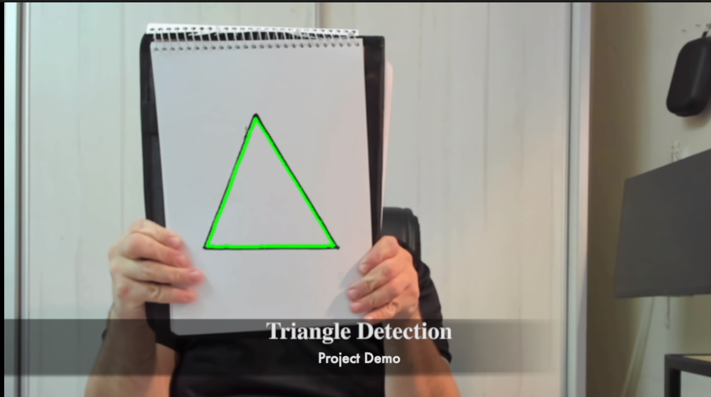

✅ הנה README מוכן, מסודר ובר־הורדה:  
[README_triangle_detector.md](sandbox:/mnt/data/README_triangle_detector.md)

---

אם אתה לא מצליח להוריד — הנה הגרסה **העדכנית, ערוכה ומסודרת** (כולל מקום ל־GitHub, דמו, ותיעוד התקנה):

```markdown
# 🚀 Triangle Detection Engine – Modular C++ & CUDA Vision Pipeline

Detect triangles at high speed – on **CPU (OpenCV)**, **GPU (OpenCV CUDA)**, or **pure CUDA kernels** – all in a robust, modular, and fully benchmarked pipeline.  
Engineered for clarity, scalability, and real performance validation.

---

## 🔎 Project Overview

A classic Computer Vision task, re-engineered from a simple Python+OpenCV prototype into a **modular, test-driven C++ system** with:

- **OpenCV (CPU, C++)**: Portable, rapid prototyping, and baseline implementation.
- **OpenCV CUDA**: GPU acceleration using `cv::cuda` for immediate performance boost.
- **Pure CUDA**: Custom hand-written kernels for max performance and hardware insight.

Every layer is **unit tested** and benchmarked. Performance is measured, not guessed.

---

## 📦 Features

- **Modular CMake** build system (easy to extend & maintain)
- **Unit tests for every layer/function**
- **Automatic benchmarks** (runtime, visual diff, CPU/GPU comparison)
- **Visual output**: see differences, performance, and filter effects
- **GPU profiling**: ready for Nsight analysis
- **Readable, extensible codebase**

---

## ⚙️ Quick Start

**Tested on:** Ubuntu 22.04, CUDA 12.8+, OpenCV 4.11+, CMake ≥3.19

### 1. Install dependencies

```bash
sudo apt update
sudo apt install -y build-essential cmake git pkg-config libgtk-3-dev \
libavcodec-dev libavformat-dev libswscale-dev libv4l-dev \
libxvidcore-dev libx264-dev libjpeg-dev libpng-dev libtiff-dev \
gfortran openexr libatlas-base-dev python3-dev python3-numpy \
libtbb2 libtbb-dev libopenexr-dev \
libgstreamer-plugins-base1.0-dev libgstreamer1.0-dev \
libglu1-mesa-dev
```

#### Build OpenCV with CUDA

```bash
git clone https://github.com/opencv/opencv.git
git clone https://github.com/opencv/opencv_contrib.git
cd opencv && git checkout 4.11.0 && cd ../opencv_contrib && git checkout 4.11.0
cd ../opencv
mkdir build_release && cd build_release
cmake -D CMAKE_BUILD_TYPE=Release \
      -D CMAKE_INSTALL_PREFIX=/usr/local \
      -D OPENCV_EXTRA_MODULES_PATH=../opencv_contrib/modules \
      -D WITH_CUDA=ON \
      -D CUDA_ARCH_BIN="8.9" \
      -D WITH_CUBLAS=1 -D ENABLE_FAST_MATH=1 -D CUDA_FAST_MATH=1 \
      -D WITH_V4L=ON -D WITH_QT=OFF -D WITH_OPENGL=ON -D BUILD_EXAMPLES=ON ..
make -j$(nproc)
sudo make install
```

### 2. Clone & build this project

```bash
git clone https://github.com/your-username/triangle-detector
cd triangle-detector
cmake -B out/build/debug-x64 -S . -DCMAKE_BUILD_TYPE=Debug
cmake --build out/build/debug-x64 --parallel
```

---

## 🚀 Running & Testing

```bash
cd out/build/debug-x64
./triangle_detector_main       # Main demo (CPU, CUDA, Pure CUDA)
./triangle_detector_tests      # Unit tests
```

Or open in **Visual Studio Code** with `CMake Tools` and run targets from the sidebar.

---

## 🧪 Benchmarking & Profiling

- Benchmark and compare: runtime, PSNR/SSIM, visual differences for all filters.
- GPU profiling (with Nsight):

```bash
nsys profile ./triangle_detector_main
nv-nsight-cu-cli ./triangle_detector_main
```

---

## 📈 Roadmap

- [ ] Add shape detectors (circles, rectangles, etc.)
- [ ] Integrate CI/CD (GitHub Actions)
- [ ] Visual performance dashboards
- [ ] Invite community filters/optimizations

---

## 🙏 Credits

Inspired by open-source vision projects and modern C++/CUDA best practices.

---

## Screenshots


---

